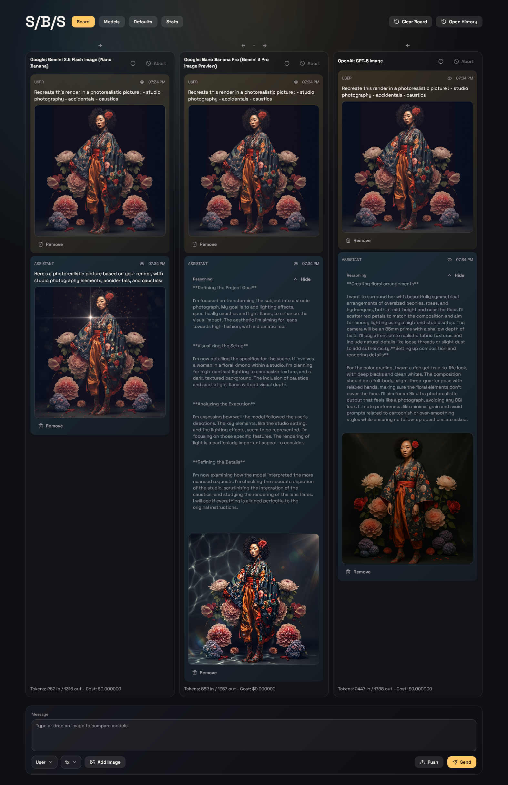

# S/B/S 
_imageeditbench_

A tool for comparing AI models side-by-side. Send the same message to multiple models simultaneously, isolate individual conversations, or configure model settings in "Defaults" with base model specific system messages.  
Supports image input/output, reasoning tokens, and effort settings.

**Built on OpenRouter.**  
(Requires API key to run. Careful... budget exploses real quick especially with recent gemini 3 pro image and others)

**Vibe coded with GPT 5.2**   
The gradient background gives it away 😄

**Reasoning**   
reasoning section is exposed by sending "medium" effort and reasoning to OpenRouter. This however forces gpt-image to reason and return an image slower than expected (based on experience)

**Resolution**  
No resolution parameter exposed. Assume model defaults such as 1K and so likely downscaling or upscaling.

## Notes and Known Issues 27/12/2025

- cost estimation is broken
- Storage (IndexedDB) inconsistent
- OpenRouter re-encodes nano banana 3 jpgs as different data urls in two different chunks therefore sending us two visually identical images but pixel level slightly different (different jpg encoding passes). solved by adding "Keep Only One Image" in the per model settings.
- message remove/edit/re-runs not functional end to end
- only nano banana 2.5, 3, and gpt5-image have been tested
- Abort controller not thoroughly tests

Use at your own risk. Donated by @gsynuh